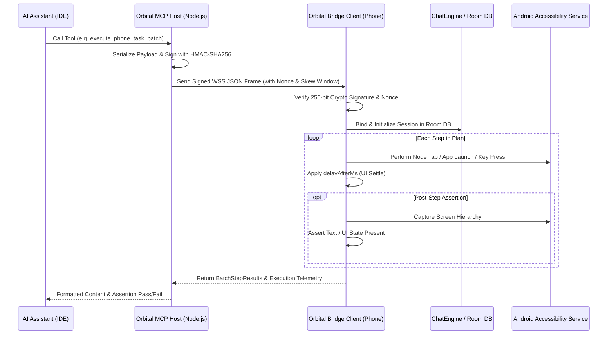

# Orbital Android Controller & Execution Guide

This skill guides AI coding assistants (**Antigravity, Cursor, Claude Desktop, Windsurf, VS Code**) on how to interact with and execute mobile automation tasks through the **Orbital MCP Bridge (`orbital-phone`)**.

---

## 🏗️ End-to-End Task Execution Flow

Every MCP action follows an authenticated, hardware-level execution pipeline:

---

## 🎯 The 4 Core Interaction Modes

### Mode 1: High-Speed Batch Interaction (`execute_phone_task_batch`)
**Best for:** Multi-step testing, form filling, and sequential UI flows in a single round-trip (<2s).
- Pre-plan a series of actions (`OPEN_APP`, `CLICK_NODE`, `TYPE_TEXT`, `PRESS_KEY`).
- Include `delayAfterMs` (e.g. 500-800ms) to allow screen rendering.
- Include `assertionText` to automatically verify expected UI states at critical steps.

### Mode 2: Autonomous On-Device AI Delegation (`ask_phone_ai`)
**Best for:** Complex natural language user goals without manually computing coordinates or node IDs.
- Example: `"Turn on flashlight and check remaining battery level"`
- The on-device companion routes locally through device intent heuristics and LLMs, records the session in Room DB, and returns the combined AI outcome.

### Mode 3: Interactive Exploration & Comprehension (`explore_and_analyze_app`)
**Best for:** Understanding unfamiliar mobile apps or extracting UX design systems.
- Launches target app, evaluates spatial layout (top bar, utilities, canvas, bottom navigation), and generates a structured product comprehension report.

### Mode 4: Discrete Step-by-Step Control
**Best for:** Fine-grained debugging or exploratory QA.
- `inspect_phone_screen` $\rightarrow$ inspects active view tree.
- `tap_phone_element` or `tap_phone_coordinates` $\rightarrow$ triggers click.
- `type_phone_text` $\rightarrow$ inputs text.
- `assert_screen_contains` $\rightarrow$ validates final visual outcome.

---

## 🛡️ Security & Reliability Best Practices

1. **Replay Protection**: The bridge enforces a 15-second timestamp window and consumes nonces via an LRU cache.
2. **Zero Hardcoding**: Never rely on static package names; use dynamic fuzzy lookup supported by the device package manager.
3. **Session Audit**: All batch tasks and phone AI delegations automatically persist to the phone's encrypted SQLite/Room database for full traceability.
